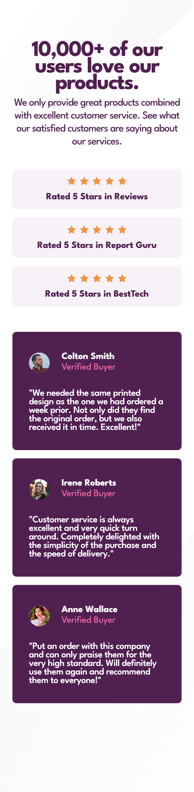
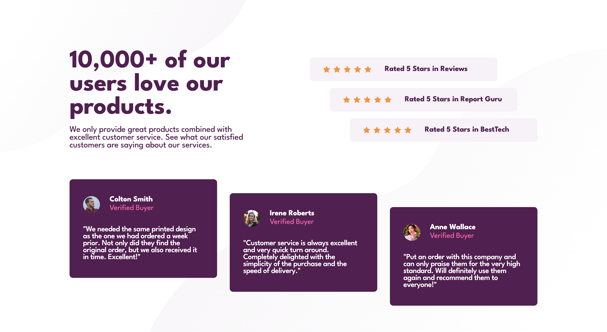

# Frontend Mentor - Social proof section solution

This is a solution to the [Social proof section challenge on Frontend Mentor](https://www.frontendmentor.io/challenges/social-proof-section-6e0qTv_bA). Frontend Mentor challenges help you improve your coding skills by building realistic projects.

## Table of contents

- [Overview](#overview)
  - [The challenge](#the-challenge)
  - [Screenshot](#screenshot)
  - [Links](#links)
- [My process](#my-process)
  - [Built with](#built-with)
  - [What I learned](#what-i-learned)
- [Author](#author)
- [Acknowledgments](#acknowledgments)

## Overview

Social Proof section

### The challenge

Users should be able to:

- View the optimal layout for the section depending on their device's screen size

### Screenshot

### Links

- Solution URL: [Add solution URL here](https://your-solution-url.com)
- Live Site URL: [Add live site URL here](https://your-live-site-url.com)

## My process

Ive been using a straight forward process with HTML and CSS together with Flexbox

### Built with

- HTML5
- CSS
- Flexbox

### What I learned

During this project I have learned how to use flexbox properties like flex-start flex-end

- Frontend Mentor - [@andreaslarssamils](https://www.frontendmentor.io/profile/andreaslarssamils)

## Acknowledgments

Thank you frontend mentor
